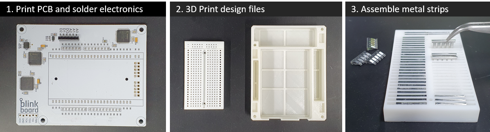
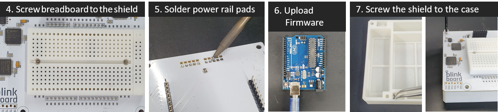
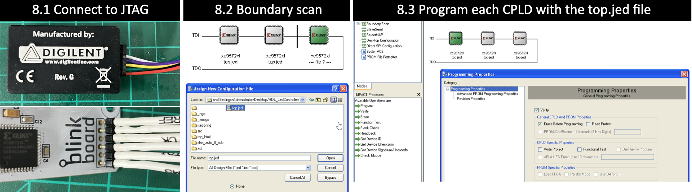

# BlinkBoard

This repository contains the hardware design of [BlinkBoard](https://blinkboard.kaist.ac.kr). An examples of software that integrates with this hardware can be found [here](https://github.com/makinteractlab/BlinkBoardApp).

This hardware is open source under the MIT license.

---

## Command Line Interface usage

This is the list of all the possible comamnds.

### Help

You can simply type `help` or use the following command to see a list of all the possible supported commands:

```js
{"cmd": "help"}  // see all supported commands
```

### Check status

Check if ready.

```js
{"cmd": "status"}    // request
{"status": "ready"}  // answer
```

### Check formware version

Check activation by passing the current month and year and see if it is <= of activation date

```js
{"cmd": "version"}  // check activateion in September 2020
{"version": "1.0"}  // answer
```

### Reset

Reset LED and outputs

```js
{"cmd": "reset"}
{"ack": "reset"}
```

### Get Input

Read A0, A1, A2 using specific number of samples (default 1 max 50);

```js
{"cmd": "analogRead"}                       // request (default samples = 1)
{"cmd": "analogRead", "samples": "5"}       // request

{"ack":"analogRead", "A0":343, "A1":371, "A2":364}  // example answer
```

### Set output

Set voltage between 0V and 4.5V on **D2**. The input value and the return voltage are clipped between 0 and 4.5V.

```js
{"cmd": "setV", "value" : "4000"}     // request
{"ack": "voltage", "value": 4000}     // answer

//clipping example
{"cmd": "setV", "value" : "5000"}     // request
{"ack": "voltage", "value": 4500}     // answer
```

**D0** and **D1** can be set HIGH/LOW or PWM.

```js
{"cmd": "setHigh", "pin": "D0"}       // request
{"cmd": "setLow", "pin": "D0"}        // request

{"ack": "setHigh", "pin": "D0"}       // answer
{"ack": "setLow", "pin": "D0"}        // answer
```

For PWM the input duty and the return voltage are clipped between 0 and 100. Pin can be **D0** or **D1**.

```js
{"cmd": "setPwm", "pin": "D0", "duty" : "90"}       // request
{"ack": "setPwm", "pin": "D0", "duty" : 90}         // answer

// clipping example
{"cmd": "setPwm", "pin": "D0", "duty" : "120"}     // request
{"ack": "setPwm", "pin": "D0", "duty" : 100}       // answer
```

### LEDs patterns

LEDs are placed in this config

```
1 -- 26
2 -- 27
3 -- 28
4 -- 29
. -- .
. -- .
. -- .
23 -- 48
24 -- 49
25 -- 50
```

Patterns:

- off
- on = steady on
- blink
- blink2 = 1/2 of blink

```js
{"cmd": "setLed", "led": "1", "pattern": "off"}
{"cmd": "setLed", "led": "1", "pattern": "on"}
{"cmd": "setLed", "led": "1", "pattern": "blink"}
{"cmd": "setLed", "led": "1", "pattern": "blink2"}

{"ack": "setLed", "led": "1", "pattern": "off"}
{"ack": "setLed", "led": "1", "pattern": "on"}
{"ack": "setLed", "led": "1", "pattern": "blink"}
{"ack": "setLed", "led": "1", "pattern": "blink2"}
```

### Set LedCmd

```js
{"cmd": "setCmdLed", "led": "vcc", "pattern": "on"}
{"cmd": "setCmdLed", "led": "gnd", "pattern": "on"}
{"cmd": "setCmdLed", "led": "a0", "pattern": "on"}
{"cmd": "setCmdLed", "led": "a1", "pattern": "on"}
{"cmd": "setCmdLed", "led": "a2", "pattern": "on"}
{"cmd": "setCmdLed", "led": "d0", "pattern": "on"}
{"cmd": "setCmdLed", "led": "d1", "pattern": "on"}
{"cmd": "setCmdLed", "led": "d2", "pattern": "on"}
{"cmd": "setCmdLed", "led": "status1", "pattern": "on"}
{"cmd": "setCmdLed", "led": "status2", "pattern": "on"}
```

### Brightness

Values of brightness between 0 and 99

```js
{"cmd": "setBrightness", "value": "1"}
{"ack": "brightness", "value": "1"}

// clipping example
{"cmd": "setBrightness", "value": "120"}
{"ack": "brightness", "value": "100"}
```

### Animate LEDs

Draw all LEDs 1-50 and vice-versa

```js
{"cmd": "animate"}
{"ack": "animate"}

// optionally put time in ms
{"cmd": "animate", value:"100"}
{"ack": "animate"}
```

### Others

Other errors

```js
{"ack":"json parse fail"}   // not valid JSON input
{"ack":"invalid command"}   // not valid command
```

---

## Hardware description

For details about the hardware design refer to the [electronic schematics](https://github.com/makinteractlab/BlinkBoard/blob/master/Altium/BlinkBoard/Project%20Outputs%20for%20BlinkBoard/BlinkBoard.PDF).

For details about how to assemble this hardware, please refer to the Hardware X paper (_link available after publication_) and the following building instructions.



- **Step 1**: The first step is to print the _BlinkBoard_ PCB shield using the supplied GERBER files and manually solder/assemble electronic components onto the printed shield. If placing an order from a manufacturer with a pick-and-place machine, provide them with the assembly instructions and the BOM file.
- **Step 2**: 3D print the breadboard and the case using the STL files. For better resolution/precision of the pinholes of the breadboard, it is recommended to print the model with ABS-like white resin (Accura Xtreme White 200) via an SLA (Stereolithography) 3D printer. However, the bottom case can be printed simply with PLA (PolyLactic Acid) using a Fused Deposition Modeling (FDM) machine, ensuring low cost and strength.

- **Step 3**: Assemble the metal clips placed underneath the breadboard to connect 2 four-hole female sockets on a row. These metal clips can be obtained by manually disassembling a 400-hole breadboard (e.g., Breadboard DM323).

- **Step 4**: Place the breadboard on the shield and use two M1.6 8mm bolts and nuts to tighten them.



- **Step 5**: Solder the ground rail on the bottom to share all the grounds on the _BlinkBoard_ shield. Make sure the ground socket of the breadboard is connected to this rail.

- **Step 6**: Before connecting the shield to an Arduino, upload the firmware via USB.

- **Step 7**: Insert the M3 nuts inside the housing slots of the case and fix the shield on the top of the 3D printed case using the M3 12mm bolts.



- **Step 8**: Generate the bitstream file from the hardware-description specifications (i.e. Verilog files) using the Xilinx ISE Design Suite and upload it via JTAG on each of the CPLDs. This step can be broken down into the following sub-steps:

  1. Power up the assembled BlinkBoard hardware by plugging it into a computer via USB. Connect BlinkBoard to the [XUP USB-JTAG Programming Cable](https://digilent.com/shop/xup-usb-jtag-programming-cable/) as shown in Figure 8.

  2. 8.2: On a PC opens the application iMPACT by Xilinx. This should automatically prompt for a boundary scanning of the connected devices, and ask to choose a file to upload to the CPLDs. Simply pick the `top.jed` file in the repository, or use the ISE Design Suite to regenerate a bitstream from the source Verilog files (HDL_LedController folder). For the success of this step, ensure that the JTAG is properly connected and that the BlinkBoard is powered up.

  3. The icons of three CPLDs connected in series should be visible on the GUI. Select each one of them and click the "Program" button on the left panel to upload the bitstream on the CPLDs.

---

## References

Controlling LEDs using the [CoolRunner-II][product]. [Schematics][schematics] and [datasheet][datasheet] are provided in the links for reference.

---

## Citation

Andrea Bianchi, Kongpyung Justin Moon, Artem Dementyev, Seungwoo Je. 2024. _BlinkBoard: Guiding and monitoring circuit assembly for synchronous and remote physical computing education_. In HardwareX 2024, e00511, ISSN 2468-0672, DOI: [https://doi.org/10.1016/j.ohx.2024.e00511](https://doi.org/10.1016/j.ohx.2024.e00511).


<!-- REFERENCES -->

[product]: https://store.digilentinc.com/cmod-c2-breadboardable-coolrunner-ii-cpld-module/
[schematics]: https://reference.digilentinc.com/_media/cmod:cmod:c-mod_c295_sch.pdf
[datasheet]: https://reference.digilentinc.com/_media/cmod:cmod:cmod_rm.pdf
